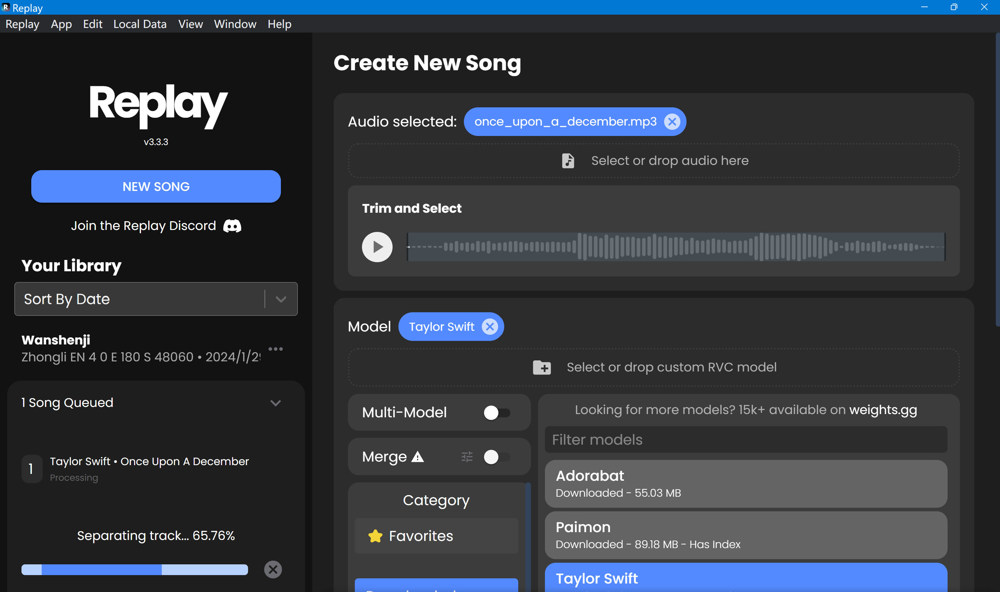

# 2024年1月27日随笔-以后凭声音还能相信是本人吗？??😿
今天尝试了一下b站最近大火的花儿不哭大佬的低样本语音克隆，太强大了，几十秒的音频居然就能够基本完美的模仿一个人的声音，整体项目部署十分简便，不得不赞叹当今人工智能技术的日新月异。
今天也同时利用Replay使用霉霉的RVC模型进行实验，样本歌曲为Wellerman和Once Upon A December，效果还不错，但是由于训练集的问题，输出的歌曲在情感表达特别强烈的地方还是会出现杂音漏音，不过整体效果还是不错的，音色基本符合，可以说是非常的惊艳了。

测试效果如下：
>Wellerman原声

<audio controls>
  <source src="Essay/散文随笔内容资源库/Wellerman.mp3" type="audio/mpeg">
  Your browser does not support the audio element.
</audio>

>Replay输出歌曲

<audio controls>
  <source src="Essay/散文随笔内容资源库/Wellerman_final.mp3" type="audio/mpeg">
  Your browser does not support the audio element.
</audio>

>Once Upon A December原声

<audio controls>
  <source src="Essay/散文随笔内容资源库/once_upon_a_december.mp3" type="audio/mpeg">
  Your browser does not support the audio element.
</audio>

>Replay输出歌曲

<audio controls>
  <source src="Essay/散文随笔内容资源库/once_upon_a_december_final.mp3" type="audio/mpeg">
  Your browser does not support the audio element.
</audio>
