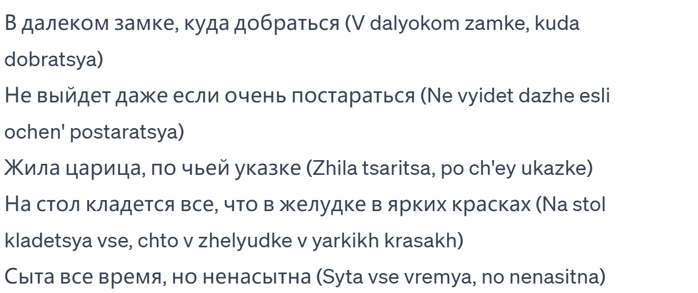
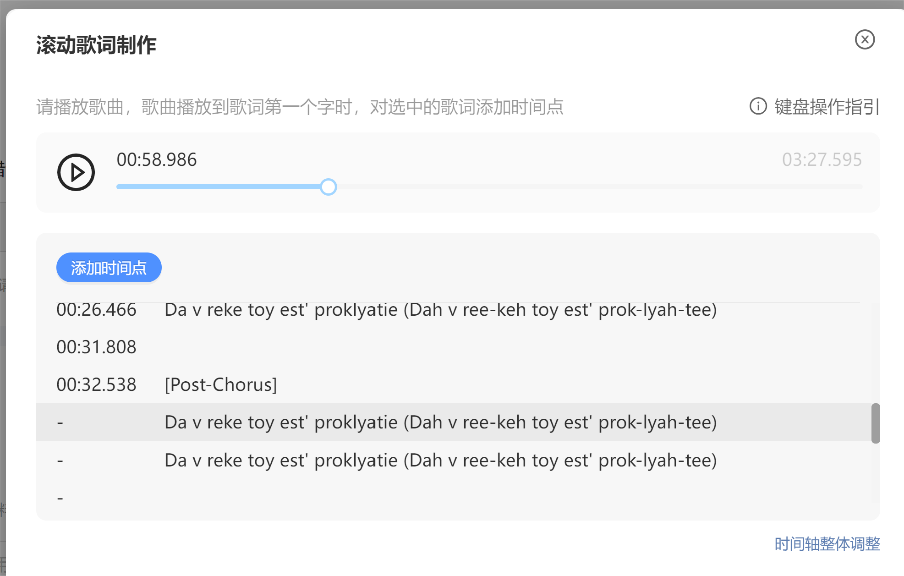
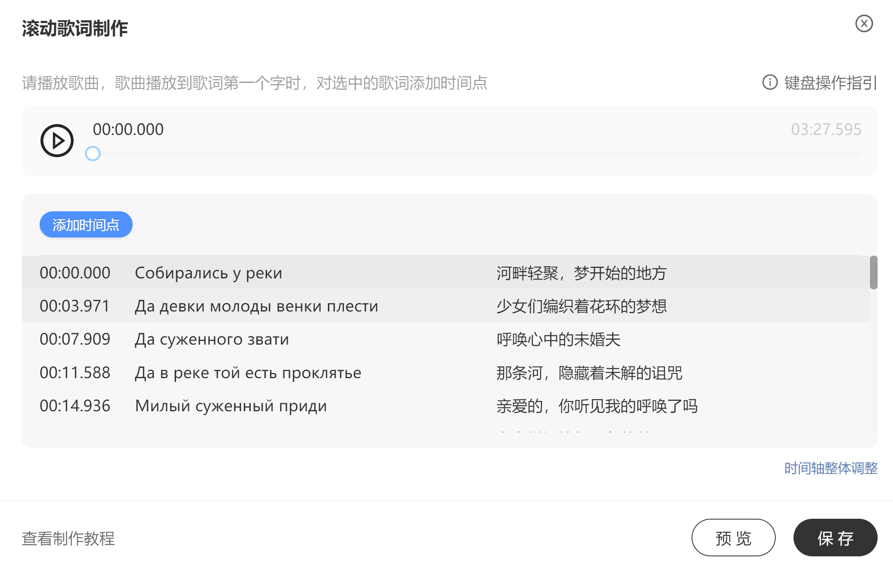
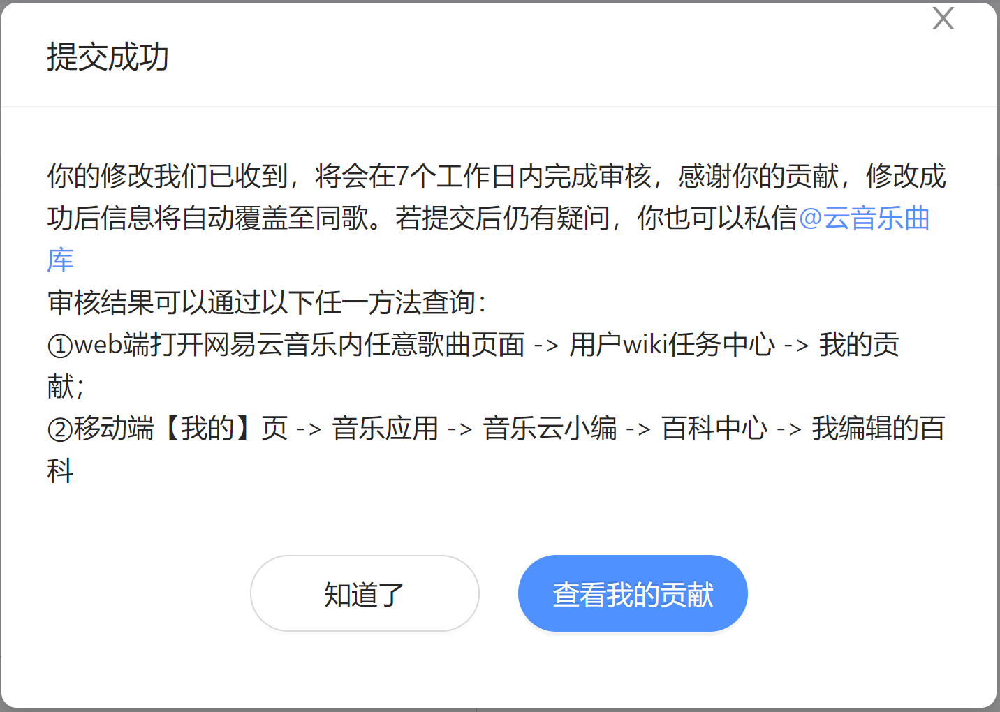
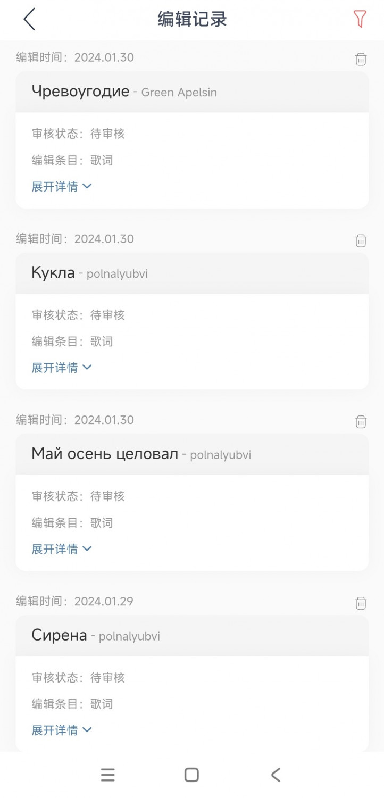

# 2024年1月30日随笔-滚动歌词制作实践

>这几天发现了几首很好听的俄语歌曲，但是这几首歌曲网易云上只有歌，没有歌词。或者有歌词，但是缺乏对应的翻译。
> 导致我只知其声却不解其意，十分懊恼，在初步了解了一些制作方法后，决定自行对这些俄语歌曲进行翻译，
> 并且有一些缺少歌词的我也去亲自制作对应的lrc滚动歌词。
> 以下是我今天制作俄语歌曲的滚动歌词的过程记录，我汇总一下，要不然之后可能会忘。

## 制作双语LRC歌词文件教程

本教程将指导您如何从俄语翻译成中文，并制作一个双语（中文-俄语）LRC歌词文件。

### 步骤 1: 添加英语发音，为了之后的LRC制作

- **目标**：将俄语歌词的英语发音添加到每一行，以确保对照准确。
- **操作**：
    1. 获取俄语歌词。
    2. 对每行俄语歌词添加相应的英语发音。
    3. 确保英语发音与俄语歌词在同一行，并用括号包围英语发音。

### 步骤 2: 使用LRC制作器

- **目标**：制作一个初步的带有时间标记的LRC文件。
- **操作**：
    1. 使用LRC歌词制作工具（如网易云上传歌词时的在线LRC编辑）。
    2. 根据歌曲的播放时间，将歌词与对应时间匹配。
    3. 保存为LRC格式文件。

### 步骤 3: 翻译成中文

- **目标**：将俄语歌词翻译成中文，替换英语发音。
- **操作**：
    1. 翻译俄语歌词为中文。
    2. 确保翻译富有诗意和意境，且逻辑连贯。
    3. 替换LRC文件中的英语发音为中文翻译。

### 步骤 4: 制作中俄双语LRC歌词

- **目标**：创建一个包含中文和俄语的双语LRC文件。
- **操作**：
    1. 在LRC文件中，将中文翻译与俄语原文分开。
    2. 确保每一行都有前面的时间标记。
    3. 对应调整时间标记以匹配歌曲节奏。

### 步骤 5: 上传到网易云音乐

- **目标**：将双语LRC文件上传到网易云音乐。
- **操作**：
    1. 打开网易云音乐客户端。
    2. 找到对应的歌曲，点击右上角的三个点，选择“上传歌词”。
    3. 选择刚刚制作好的双语LRC文件，点击“打开”。
    4. 点击“上传”。

下面放上我今天学习制作lrc时对应的歌曲，也可以从网易云上找到：

1、Green Apelsin Чревоугодие

<audio controls>
  <source src="Essay/散文随笔内容资源库/Green Apelsin  Чревоугодие.mp3" type="audio/mpeg">
  Your browser does not support the audio element.
</audio>

2、polnalyubvi  Кукла

<audio controls>
  <source src="Essay/散文随笔内容资源库/polnalyubvi  Кукла.mp3" type="audio/mpeg">
  Your browser does not support the audio element.
</audio>

3、polnalyubvi  Май осень целовал

<audio controls>
  <source src="Essay/散文随笔内容资源库/polnalyubvi  Май осень целовал.mp3" type="audio/mpeg">
  Your browser does not support the audio element.
</audio>

4、polnalyubvi  Сирена

<audio controls>
  <source src="Essay/散文随笔内容资源库/polnalyubvi  Сирена.mp3" type="audio/mpeg">
  Your browser does not support the audio element.
</audio>