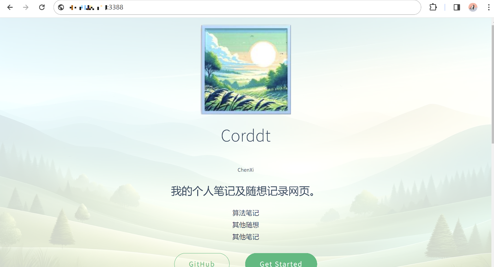

#  2024年2月7日随笔-所以说部署这个网站花了我整整一天！——dockerの学习日记

>最近在刷bilibili的时候，对一项技术很感兴趣，即docker，听说用了这项技术之后，
对一些java和python程序的部署会变得非常方便，另外，我因为刚刚部署了Lubuntu系统，
而Lubuntu是可以连接我云端的服务器的,所以我就想着学习一下这项技术，然后就开始了我的docker之旅。
>* 我为什么不用我的Lubutu直接部署docker?因为docker只有64位的，而32位无法部署64位的docker)，


>我使用的服务器是Alibaba Cloud Linux 3，首先我参考了这个技术文档完成了docker的基础搭建，
[部署并使用Docker（Alibaba Cloud Linux 3）](https://developer.aliyun.com/article/1328603)
但是有个小问题在于，我一开始看的不是太详细，安装的是dnf源中默认的Docker（podman-docker），
但后来，因为由于podman-docker没有守护进程（systemd），我之后如果要跟着一些教程做别的事情的话，
没法完全跟着做，这样的话如果出现一些那些教程里没有出现的问题的话我就没法解决了，
因此我运行了删除podman的指令，即`sudo yum remove podman-docker`，然后又重新安装了docker-ce，
即docker社区版，这样就解决了这个问题,并且我也学会了如何使用docker的一些基本命令。

>我主要是在docker安装上参考了技术文档，后面在用docker进行基础的静态网站部署的时候，又找了别的教程来做，
以下是我利用docker部署静态网站的基本过程：

### 1. 克隆仓库

因为我要部署的是一个静态网站，所以我先克隆了一个静态网站的仓库到本地计算机。在终端中执行：
我选择的是克隆我的一个较为简单的 `easy_copy` 项目到本地计算机。在终端中执行：

```bash
git clone https://github.com/Corddt/easy_copy.git
cd easy_copy
```

### 2. 创建 Dockerfile

在项目的根目录（现在是 `easy_copy` 目录）中创建 `Dockerfile`。
* 需要注意的是，这个Dockerfile需要和index.html文件**在同一个目录下**。如果不在同一个目录下，需要在Dockerfile中指定index.html的路径。
由于项目是纯静态的，不需要构建步骤，我使用 Nginx 来作为 web 服务器。

这是我的 `Dockerfile` 的内容：
```Dockerfile
# 使用官方 Nginx 镜像作为基础镜像
FROM nginx:alpine

# 将整个项目文件复制到容器内的 Nginx 服务器目录
COPY . /usr/share/nginx/html

# 暴露 80 端口
EXPOSE 80

# 使用 Nginx 默认的启动命令
CMD ["nginx", "-g", "daemon off;"]
```

这个 Dockerfile 做了以下几件事情：

- 从 Docker Hub 上获取轻量级的 Nginx 官方镜像（`nginx:alpine`）作为基础镜像。
- 将当前目录下的所有项目文件（包括 `index.html` 和其他可能的静态文件）复制到容器内的 `/usr/share/nginx/html`。这是 Nginx 用来存放静态文件的默认目录。
- 暴露容器的 80 端口，这是 Nginx 的默认端口。
- 设置默认命令为启动 Nginx 服务器。

### 3. 构建 Docker 镜像

在项目包含 Dockerfile 和 index.html 的目录下，运行以下命令来构建 Docker 镜像：

```bash
docker build -t easy-copy-site .
```

### 4. 运行 Docker 容器

使用以下命令从构建的镜像中启动一个容器：

```bash
docker run -d -p 8080:80 easy-copy-site 
# -d 表示在后台运行容器，-p 8080:80 表示将容器的 80 端口映射到本地的 8080 端口，
# 这个端口可以根据需要进行调整，但是换了端口时，需要保证云端安全组中的端口也是开放的。
```

### 5. 访问网站
根据浏览器的ip地址和端口号，访问对应网站。

### 6. 过程中遇到的问题的解决

在过程中，我遇到了端口被占用的问题，我想要对外开放的端口号，假设是3387，但是我发现这个端口号被占用了，
1. **找到端口**：
我首先用
```markdown
sudo lsof -i:3387
```
然后又用 `docker ps` 命令来列出所有运行中的容器，并查找那些绑定到 `3387` 端口的容器。

2. **停止容器**：之后我用以下命令停止占用 `3387` 端口的容器：

   ```bash
   docker stop <容器ID或名称>
   ```
   其中 `<容器ID或名称>` 是找到的占用 `3387` 端口的容器的 ID 或名称。

3. **移除容器**：因为不再需要这个容器了，所以我使用以下命令将其移除：

   ```bash
   docker rm <容器ID或名称>
   ```
    其中 `<容器ID或名称>` 是找到的占用 `3387` 端口的容器的 ID 或名称。

4. **重新启动容器**：确认 `3387` 端口已经释放后，我重新启动容器，再次尝试使用 `3387` 端口：

   ```bash
   docker run -d -p 3387:80 easy-copy-site
   ```
    这次，容器成功地在 `3387` 端口上运行了。

### 说明：

- 如果 `3387` 端口被 `docker-proxy` 占用，并且没有具体的容器名称或 ID 与之关联，可能是之前的容器没有被正确停止或者 Docker 状态出现异常。在这种情况下，重启 Docker 服务可能有助于解决问题：

  ```bash
  sudo systemctl restart docker
  ```

- 重启 Docker 服务将停止所有运行中的容器，因此请确保这一操作不会影响到其他重要容器的运行。

- 在进行任何重启操作之前，确保已经保存了所有重要数据，以防丢失。

后面，我又尝试用3388部署了我的博客，也是能够成功访问的：
