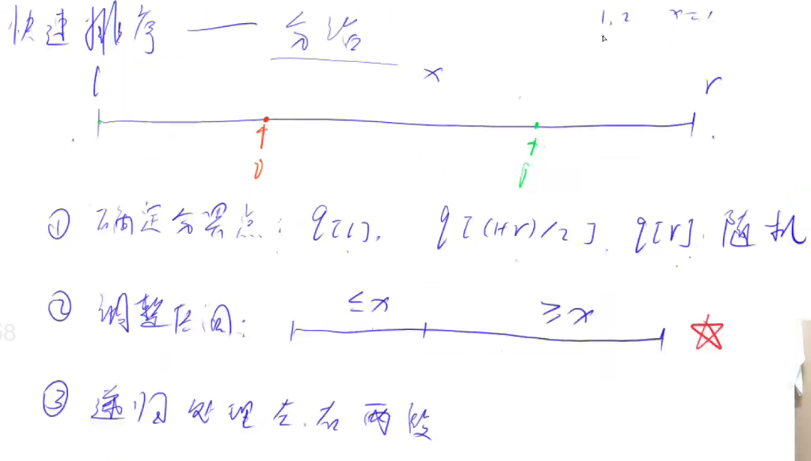

# 快速排序
## 听课笔记

## 代码记忆

```java
#include <iostream>  // 引入iostream库，提供输入输出功能

using namespace std;  // 使用标准命名空间std，避免每次调用标准库函数时都要加std::前缀

const int N = 100010;  // 定义常量N，数组q的最大长度

int q[N];  // 定义一个长度为N的数组q，用于存储待排序的整数

// 定义快速排序函数，对数组q的区间[l, r]进行排序
void quick_sort(int q[], int l, int r)
{
    if (l >= r) return;  // 如果区间长度小于或等于1，不需要排序，直接返回

    int i = l - 1, j = r + 1;  // 初始化指针i和j
    int x = q[l + r >> 1];  // 选择中间位置的元素作为基准值

    // 进行分区操作
    while (i < j)
    {
        do i ++ ; while (q[i] < x);  // 从左向右找到第一个大于等于x的元素
        do j -- ; while (q[j] > x);  // 从右向左找到第一个小于等于x的元素
        if (i < j) swap(q[i], q[j]);  // 交换这两个元素的位置
    }

    // 对左半部分和右半部分分别递归调用快速排序
    quick_sort(q, l, j);
    quick_sort(q, j + 1, r);
}

int main()
{
    int n;  // 定义变量n，表示数组q中元素的数量
    scanf("%d", &n);  // 从标准输入读取n的值

    // 读取n个整数填入数组q
    for (int i = 0; i < n; i ++ ) scanf("%d", &q[i]);

    // 调用快速排序函数对数组q进行排序
    quick_sort(q, 0, n - 1);

    // 输出排序后的数组
    for (int i = 0; i < n; i ++ ) printf("%d ", q[i]);

    return 0;  // 程序正常结束
}

```

## 理解测试问答
>1、首先，解释一下这段代码中的分区过程（partitioning process）是如何工作的。它是快速排序中最关键的部分。你需要详细说明变量 i 和 j 是如何移动的，以及 x 作为枢纽（pivot）的作用是什么。同时，解释为什么在递归调用 quick_sort 函数时，使用的下标是 j 而不是 i。这里的逻辑你要清楚。

在这个代码中，x是作为枢纽值（pivot），它的选择是基于当前要排序部分的中间值。i 和 j 的移动是基于与x的比较。具体来说，i 会一直向右移动直到它找到一个大于或等于x的元素，同时，j会向左移动直到它找到一个小于或等于x的元素。一旦找到这样的元素，如果i < j，这两个元素会被交换位置。这个过程会一直进行，直到i和j相遇。

关于递归调用quick_sort时使用j而不是i，这是因为在最后一次交换后，i和j的位置会交错（即i会比j大），这表明j已经是排序好的部分的一部分了。所以，左半部分的排序是到j，而右半部分的排序从j+1开始。

>2、请解释这个快速排序实现的时间复杂度，并讨论在什么情况下它会达到最差的性能。

快速排序的平均时间复杂度确实是 O(nlog⁡n)O(n\log n)O(nlogn)，这是在随机数据或者数据分布均匀的情况下的表现。但是，你对于最差性能情况的解释不够准确。

快速排序的最差性能发生在每次分区操作都导致一边的元素数量极少（理想情况下应该是平均分配）时。具体来说，当输入数组已经是排序好的（无论是升序还是降序），或者所有元素都相等时，每次分区只能减少一个元素，这时的时间复杂度会退化为 O(n2)O(n^2)O(n2)。

>3、为什么选择 `x = q[l + r >> 1]` 作为枢纽值？这种选择方法有什么优点和可能的缺点？

首先，`x = q[l + r >> 1]` 这行代码确实使用了位运算来计算中点索引，这是为了获取数组的中间元素作为枢纽（pivot）。位运算 `>> 1` 相当于除以2，它的确比常规除法更高效。这个选择方法的优点是简单且在很多情况下能够提供不错的分区平衡，从而让快速排序在平均情况下达到 O(nlog⁡n)O(n\log n)O(nlogn) 的效率。

然而，你提到的溢出问题不是主要的缺点。在C++中，当 `l` 和 `r` 都是非负数时，`l + r` 可能会超过整型的最大值而导致溢出。但在实际的排序应用中，这种情况相对少见。

更重要的缺点是，当输入数组几乎或完全有序时，这种选择方法可能导致枢纽值不能很好地将数据分成两部分，从而影响排序效率，使时间复杂度接近 O(n2)O(n^2)O(n2)。

>4、代码中使用了 `swap(q[i], q[j])` 进行元素交换。请解释C++中 `swap` 函数的工作原理及其时间复杂度。同时，讨论使用 `swap` 函数与直接操作数组元素进行交换之间的差别和优势。

C++中的 `swap` 函数用于交换两个变量的值。在你的代码中，`swap(q[i], q[j])` 用于交换数组中索引为i和j的两个元素。`swap` 函数通常是通过引用传递其参数，然后内部使用一个临时变量来完成值的交换。具体来说，它会创建一个临时变量来存储一个值，然后将第二个值赋给第一个值，最后将临时变量的值赋给第二个值。

`swap` 函数的时间复杂度是常数时间 O(1)O(1)O(1)，因为它只涉及几次赋值操作，不依赖于数据的大小。

使用 `swap` 函数的优点包括代码的清晰性和可维护性。它使代码更易读懂，错误可能性更低。直接操作数组元素进行交换虽然在某些情况下可以节省一点点性能（比如避免了函数调用的开销），但这种优势通常是微不足道的，而且会牺牲代码的可读性和可能引入错误的风险。

>5、请解释代码中的 `if (l >= r) return;` 这一行的作用是什么？为什么在快速排序的递归过程中需要这样的检查？


在快速排序的每一次递归调用中，`l` 和 `r` 分别代表当前要排序部分的起始和结束位置。当 `l >= r` 成立时，意味着当前考虑的区间已经没有元素或者只剩下一个元素。在排序的过程中，一个元素或者空的区间本身就是有序的，不需要进一步的排序操作。因此，这个条件检查是用来确定递归的基准情况，即何时停止递归。

快速排序是一个递归的算法，适当的基准情况是确保递归能够正确并有效地结束的关键。没有这个检查，递归可能会无限进行下去，导致栈溢出错误。

>6、在快速排序中，如何选择一个好的枢纽（pivot）值？你的代码中选择了中间值，但还有没有其他方法？这些方法有什么优缺点？

“三数取中”（Median-of-Three）方法是一种选择枢纽（pivot）值的策略，用于改善快速排序的性能，尤其是在面对特定类型的输入时。这个策略包括从序列的头部、尾部和中间选择三个元素，然后使用这三个元素的中位数作为枢纽值。

“三数取中”方法的优点包括：
1. **减少最坏情况发生的概率** ：对于已经部分排序的数组，这种方法比简单选择中间元素或首元素作为枢纽的方式更不容易产生最差性能。
2. **更好的分区平衡** ：选择更接近中位数的枢纽值可以更均匀地分割数组，从而提高排序效率。

其缺点是：
1. **增加了计算成本** ：在每次递归之前，需要额外的步骤来计算三个元素的中位数，这在元素数量较少时可能会引入额外的开销。
2. **复杂性增加** ：相比于简单选择一个枢纽值，这种方法使得算法实现更复杂。

除了“三数取中”方法，还有其他策略，如随机选择枢纽值，这可以在理论上减少在特定输入下达到最差性能的可能性。

>7、快速排序是用递归实现的。请讨论递归实现与非递归（迭代）实现快速排序的差别和各自的优势。


快速排序可以用递归或非递归（迭代）的方式实现。你的代码中使用了递归方法。下面是两种方法的比较：
1. **递归实现** ：
- **优点** ：
- 代码简洁明了，易于理解和实现。
- 递归结构自然地适应了分治算法的思想，快速排序本质上就是一个分治算法。
- **缺点** ：
- 可能会导致栈溢出。在最坏的情况下（比如当数组已经排序时），递归深度可以达到数组的长度，可能会导致调用栈过深。
- 递归调用有额外的开销，每一层递归都需要时间和空间来保存函数调用的状态。
1. **非递归（迭代）实现** ：
- **优点** ：
- 避免了栈溢出的风险。通过使用栈来模拟递归，可以控制栈的大小，防止栈溢出的问题。
- 对于某些大数据集，迭代实现可能比递归实现更高效，因为它避免了递归调用的开销。
- **缺点** ：
- 代码实现相对复杂，不如递归直观。
- 需要手动管理栈，这可能会使代码的可读性和维护性降低。

>8、在快速排序中，稳定性是一个重要的考虑因素。请解释什么是排序算法的稳定性，并讨论快速排序是否是一个稳定的排序算法，以及为什么。

排序算法的稳定性指的是排序后相等的元素之间的相对顺序保持不变。如果一个排序算法能保持相等元素的原始顺序，则称这个算法是稳定的。

快速排序不是一个稳定的排序算法。原因在于它在分区过程中可能会改变相等元素的相对顺序。当进行元素交换时，相等的元素可能被移动到其它相等元素的前面或后面，从而打乱它们原本在数组中的顺序。

例如，考虑一个数组 [2a, 3, 2b, 1]（这里的2a和2b表示值相等但是是不同的元素）。在快速排序的某些情况下，2a和2b的顺序可能会在排序后被交换，从而导致排序的不稳定。

>9、在你的代码中，快速排序使用了递归。请解释递归在快速排序中的作用是什么，以及递归过程中可能出现的问题有哪些？


递归在快速排序中的作用是实现分治策略。分治策略包括三个步骤：分解、解决和合并。在快速排序中：
1. **分解** ：快速排序首先选择一个枢纽值，然后根据这个值将数组分为两部分，使得一部分的所有元素都小于等于枢纽值，而另一部分的所有元素都大于等于它。
2. **解决** ：通过递归调用快速排序，分别对两个子数组进行排序。
3. **合并** ：在快速排序中，合并步骤不需要任何操作，因为所有子数组都是原地排序的。

递归过程中可能出现的问题包括：
- **栈溢出** ：在最坏的情况下（例如，数组已经是完全排序的），快速排序可能需要递归地进行 O(n)O(n)O(n) 次调用，这可能导致调用栈过深，从而引发栈溢出错误。
- **性能问题** ：在最坏的情况下，快速排序的时间复杂度会退化到 O(n2)O(n^2)O(n2)，尤其是当枢纽值选取不佳时。
- **空间复杂度** ：虽然快速排序是原地排序，但是因为递归调用，它的空间复杂度不是常数。在平均情况下，空间复杂度是 O(log⁡n)O(\log n)O(logn)。

>10、代码中使用了C++的STL函数 `swap`。请解释一下C++中STL的概念是什么，以及它在现代C++编程中的作用和重要性。

C++的STL（Standard Template Library，标准模板库）是C++标准库的一部分，它提供了一系列的模板类和模板函数。这些模板主要包括四大组件：
1. **容器（Containers）** ：如向量（vector）、列表（list）、集合（set）等，用于存储数据。
2. **迭代器（Iterators）** ：作为容器与算法之间的桥梁，允许对容器中的元素进行访问和遍历。
3. **算法（Algorithms）** ：如排序（sort）、搜索（find）、变换（transform）等操作，用于处理数据。
4. **函数对象（Function objects）** ：用于定制算法的行为，比如定义比较或操作的方式。

STL的重要性在于：
- **提高开发效率** ：STL提供了大量现成的数据结构和算法，减少了开发者的工作量。
- **代码重用** ：通过模板，STL允许以类型无关的方式编写代码，增加了代码的复用性。
- **性能优化** ：STL的实现高效且经过优化，能够提供比手写代码更好的性能。
- **类型安全** ：相比于C语言的泛型机制（如void指针），C++的模板提供了更好的类型安全。

在现代C++编程中，STL是非常核心的一部分，深刻理解和熟练使用STL对于编写高效、可读性好的C++代码至关重要。

>11、在你的快速排序代码中，使用了递归。递归在某些情况下可能导致性能问题。请解释一下递归可能带来的性能问题，并讨论如何优化或避免这些问题。

递归在某些情况下可能带来以下性能问题：
1. **栈溢出** ：每当函数调用自己，都会在栈上增加一个新的层次。如果递归调用次数过多，可能会消耗过多的栈空间，导致栈溢出。
2. **重复计算** ：在某些递归算法中，相同的计算可能会被重复执行多次，这会导致不必要的计算开销。
3. **函数调用开销** ：每次函数调用都会有一定的开销，包括保存寄存器状态、参数传递等。递归中频繁的函数调用可能会导致性能下降。

要优化或避免这些问题，可以采取以下措施：
1. **尾递归优化** ：在递归的最后执行递归调用，而不是在中间或开始。某些编译器能够识别尾递归并优化它，将其转换为迭代，从而减少栈空间的使用。
2. **使用迭代代替递归** ：在可能的情况下，用迭代的方式重写递归逻辑。迭代不会增加额外的栈空间，通常更高效。
3. **记忆化（Memoization）** ：对于那些重复计算相同结果的递归调用，可以通过存储已经计算过的结果来避免重复计算。
4. **限制递归深度** ：在递归函数中设置深度限制，以防止栈溢出。

>12、在你的快速排序代码中，如果输入的数组已经是排序好的（无论是升序还是降序），快速排序的性能会怎样？为什么会出现这种情况，你会如何改进算法以应对这种情况？

当输入的数组已经是排序好的（无论是升序还是降序），快速排序的性能会很差，接近 O(n2)O(n^2)O(n2)。这种情况下，每次分区操作只能将数组分为两个部分，其中一个部分始终只包含一个元素（枢纽元素），而另一个部分包含剩下的所有元素。这导致分区操作无法有效地减少问题的规模，递归的深度将接近数组的长度，从而产生大量的递归调用。

为了改进算法以应对这种情况，可以采用以下策略：
1. **改进枢纽元素的选择** ：使用“三数取中”法或随机选择枢纽元素，可以增加枢纽元素分区效果的概率，避免在已排序数组中性能退化。
2. **引入小数组的插入排序** ：对于较小的子数组，使用插入排序而不是快速排序。插入排序在小数组上效率较高，且是稳定的。
3. **使用非递归实现** ：通过使用栈来模拟递归调用的方式，实现非递归的快速排序，以减少递归调用带来的开销。


