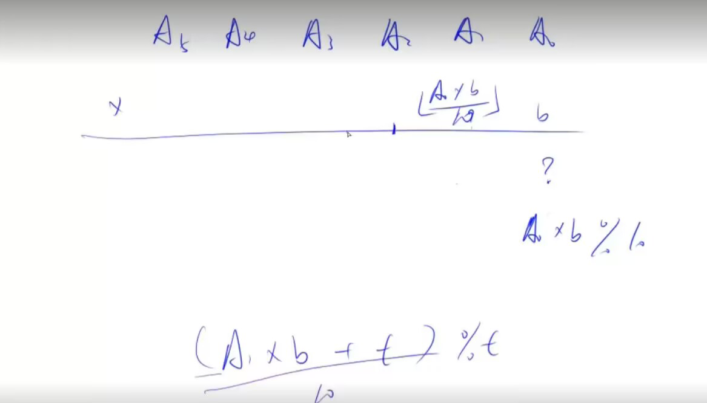
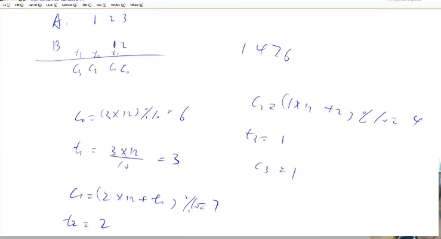

# 高精度乘法

## 题目

给定两个非负整数（不含前导0）`A`和`B`，请你计算`A×B`的值。

### 输入格式

共两行，第一行包含整数`A`，第二行包含整数`B`。

### 输出格式

共一行，包含`A×B`的值。

### 数据范围

`1≤A的长度≤100000, 0≤B≤10000`

### 输入样例：

```
2
3
```

### 输出样例：

```
6
```

## 课程笔记


## 一些我没懂的地方的详细解释
好的，让我们通过一个具体的例子来进一步解释这个过程。假设我们要计算的大数`A`为`123`（实际存储为逆序数组`A=[3,2,1]`），整数`b`为`4`，我们希望计算`123 * 4`的结果。

#### 初始化

- 大数`A`被存储为数组`A=[3,2,1]`，每个元素代表大数的一位，逆序存储。
- 整数`b`是`4`。
- 我们用`vector<int> C`来存放最终的乘积结果，初始为空。
- `int t = 0;`用来存放临时的乘积和进位，初始为0。

#### 循环计算过程

1. **第一轮循环（i=0）**：
    - `t += A[0] * b;` => `t += 3 * 4;` => `t = 12;`
    - `C.push_back(t % 10);` => `C.push_back(2);` => `C=[2]`；
    - `t /= 10;` => `t = 1;`（进位）

2. **第二轮循环（i=1）**：
    - `t += A[1] * b;` => `t += 2 * 4 + 1;` => `t = 9;`（包括上一步的进位）
    - `C.push_back(t % 10);` => `C.push_back(9);` => `C=[2, 9]`；
    - `t /= 10;` => `t = 0;`（没有进位）

3. **第三轮循环（i=2）**：
    - `t += A[2] * b;` => `t += 1 * 4 + 0;` => `t = 4;`（上一步没有进位）
    - `C.push_back(t % 10);` => `C.push_back(4);` => `C=[2, 9, 4]`；
    - `t /= 10;` => `t = 0;`（没有进位）

4. **循环结束**：由于`A`的所有位都处理完了，且`t`为0，不再有进位需要处理，循环结束。

#### 结果

最后，`C=[2, 9, 4]`，这是乘积`492`的逆序表示。为了得到正确的乘积，我们需要逆序打印`C`，即`492`，这就是`123 * 4`的结果。


## 代码

```cpp
#include <iostream>
#include <vector>

using namespace std;

// 定义一个函数，用于实现大数A与整数b的乘法
vector<int> mul(vector<int> &A, int b)
{
    vector<int> C; // 存放乘法结果的数组

    int t = 0; // 用于存放每一位相乘的临时结果及进位
    for (int i = 0; i < A.size() || t; i++ )
    {
        if (i < A.size()) t += A[i] * b; // 如果A的位数还没有遍历完，累加当前位与b的乘积
        C.push_back(t % 10); // 将乘积的个位数添加到C中
        t /= 10; // 计算进位
    }

    while (C.size() > 1 && C.back() == 0) C.pop_back(); // 去除结果前端的0

    return C; // 返回乘法结果
}

int main()
{
    string a; // 存放输入的大数A
    int b; // 存放输入的整数B

    cin >> a >> b; // 输入A和B

    vector<int> A; // 用于存放大数A的每一位
    for (int i = a.size() - 1; i >= 0; i-- ) A.push_back(a[i] - '0'); // 将大数A的每一位转化为整型并逆序存储

    auto C = mul(A, b); // 调用mul函数计算A和b的乘积

    for (int i = C.size() - 1; i >= 0; i-- ) printf("%d", C[i]); // 逆序打印结果，得到正确顺序的乘积结果

    return 0; // 程序结束
}
```


