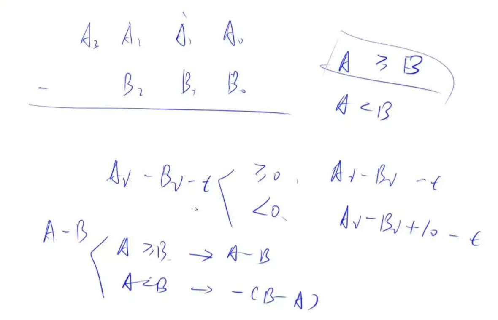

# 高精度减法
## 听课笔记



## 题目描述

给定两个正整数（不含前导0），计算它们的差，计算结果可能为负数。

**输入格式：**

共两行，每行包含一个整数。

**输出格式：**

共一行，包含所求的差。

**数据范围：**

`1 ≤ 整数长度 ≤ 10^5`

**输入样例：**

```
32
11
```

**输出样例：**

```
21
```

## 思路

本题要求处理两个非常大的正整数的减法问题，这些整数可能远远超出了常规整数类型能表示的范围。为了解决这个问题，我们可以将每个整数表示为一个数组，每个元素存储整数的一位数字。通过这种方式，我们可以模拟手工减法的过程，包括处理借位的情况。这种方法被称为高精度减法。

1. **比较大小**：首先判断两个数的大小，确定减数和被减数，因为结果可能为负数。
2. **逐位减法**：从低位到高位逐位相减，注意处理借位。
3. **去除前导0**：计算结果后，去除结果的前导0（如果有的话）。

## 代码

```cpp
// 包含输入输出流库，用于读取输入和输出结果
#include <iostream>
// 包含向量（动态数组）库，用于存储和操作大整数的各个数字
#include <vector>

// 使用命名空间std，省去了std::的前缀
using namespace std;

// 比较两个大整数的大小，A和B是两个用vector<int>存储的大整数
bool cmp(vector<int> &A, vector<int> &B)
{
    // 如果两个数的长度不同，则长度更长的数更大
    if (A.size() != B.size()) return A.size() > B.size();

    // 如果长度相同，则从最高位开始比较，找到第一个不同的数字来判断大小
    for (int i = A.size() - 1; i >= 0; i -- )
        if (A[i] != B[i])
            return A[i] > B[i]; // 如果A在这一位上大于B，则A整体大于B

    // 如果两个数完全相同，则认为A不小于B
    return true;
}

// 实现两个大整数的减法操作，A和B是两个用vector<int>存储的大整数
vector<int> sub(vector<int> &A, vector<int> &B)
{
    vector<int> C; // 存储结果的向量
    for (int i = 0, t = 0; i < A.size(); i ++ )
    {
        t = A[i] - t; // t用于记录借位，初始时没有借位
        if (i < B.size()) t -= B[i]; // 如果B的位数足够，从A中减去B的相应位
        C.push_back((t + 10) % 10); // 将结果加10后取模10，保证结果为非负数，并存入结果向量C
        if (t < 0) t = 1; // 如果t小于0，说明发生了借位
        else t = 0; // 否则重置借位标志
    }

    // 去除结果前面的0，保留至少一位数字
    while (C.size() > 1 && C.back() == 0) C.pop_back();
    return C; // 返回结果向量
}

// 主函数
int main()
{
    string a, b; // 存储输入的两个大整数的字符串表示
    vector<int> A, B; // 将输入的大整数转换为vector<int>形式
    cin >> a >> b; // 读取两个大整数
    // 将字符串表示的大整数逆序存入向量A和B中，使得最低位在向量的开头
    for (int i = a.size() - 1; i >= 0; i -- ) A.push_back(a[i] - '0');
    for (int i = b.size() - 1; i >= 0; i -- ) B.push_back(b[i] - '0');

    vector<int> C; // 存储最终的减法结果

    // 比较A和B的大小，以确定减法的顺序
    if (cmp(A, B)) C = sub(A, B); // 如果A大于等于B，直接计算A-B
    else C = sub(B, A), cout << '-'; // 如果A小于B，计算B-A并输出负号

    // 输出最终的减法结果
    for (int i = C.size() - 1; i >= 0; i -- ) cout << C[i];
    cout << endl; // 换行

    return 0; // 程序正常结束
}

```