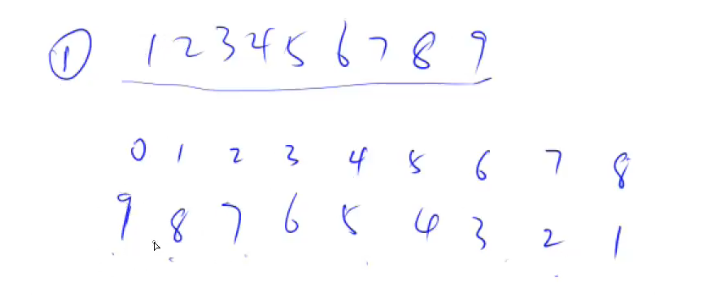
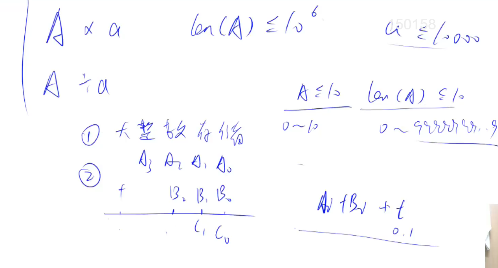

# 高精度加法
## 听课笔记





## 思路
* 模拟手动加法计算即可。

* 例如计算：567 + 28
* 先个位相加： 7 + 8 = 15，所以结果的个位是5，向十位进 1
* 再十位相加： 6 + 2 + 1（进位）= 9， 所以十位是 9，向百位进 0
* 再百位相加： 5 + 0 = 5， 所以结果的百位是 5

* 综上，计算结果为 595

## 算法
* 计算 567 + 28

* 用 a, b 两个字符串存储输入。a = 567, b = 28
* 为了方便计算，将两个数分别 倒序 存放在 A， B 两个整数数组中。 A = [7, 6, 5], B = [8, 2]
* 新建整数数组 C 保存结果，整型变量 t 保存进位，初始 t = 0.
* 将各个位上的数字相加，求出结果对应位上的数字和进位。
* 例如对个位计算： A[0] + B[0] = 7 + 8 = 15, 结果个位上是 5， 进位是 1. 
* 所以 C[0] = 5, 进位 t = 1
* 最后把结果数组 C 中就保存了计算倒序结果，倒序输出就是答案

## 代码
```cpp
#include <iostream>
#include <vector>
using namespace std;
vector<int> add(vector<int> &A, vector<int> &B)
{
//为了方便计算，让A中保存较长的数字， B中保存较短的数字
if (A.size() < B.size()) return add(B, A);
//保存结果的数组
vector<int> C;
//进位，开始时是0
int t = 0;
//依次计算每一位
for (int i = 0; i < A.size(); i ++ )
{
t += A[i];//加上 A 的第 i 位上的数字
if (i < B.size()) t += B[i];//加上 B 的第 i 位上的数字
C.push_back(t % 10); //C 中放入结果
t /= 10;//t 更新成进位
}
//最后如果进位上有数，放进结果数组
if (t) C.push_back(t);
return C;//返回结果
}

int main()
{
string a, b;//以字符串形式保存输入的两个整数
vector<int> A, B;//保存两个整数的数组
cin >> a >> b;//接收输入
for (int i = a.size() - 1; i >= 0; i -- ) A.push_back(a[i] - '0');//倒序存储第一个数
for (int i = b.size() - 1; i >= 0; i -- ) B.push_back(b[i] - '0');//倒序存储第二个数
auto C = add(A, B);//调用加和函数
for (int i = C.size() - 1; i >= 0; i -- ) cout << C[i];//倒序输出C中的数字
cout << endl;
return 0;
}
```

