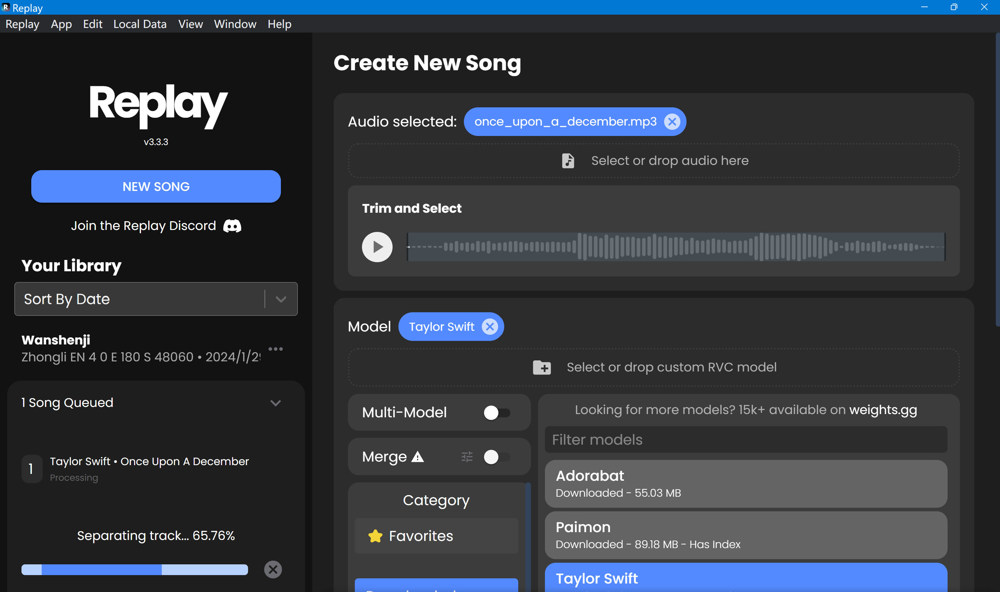

# 2024年1月27日随笔-以后凭声音还能相信是本人吗？??😿
>今日，我体验了B站热门话题——花儿不哭大佬的低样本语音克隆技术，其强大之处令人赞叹。仅凭几十秒的音频，便能精准模拟出某人的声音，这一成就彰显了人工智能技术的突飞猛进。整个项目的部署过程简洁高效，让我不由得对这样的开源精神感到敬佩。

>同时，我还利用Replay平台上的霉霉RVC模型进行了一番实验。选取的样本歌曲包括《Wellerman》和《Once Upon A December》，结果颇为令人满意。虽然由于训练集限制，在歌曲中情感表达最为强烈的部分偶有杂音和漏音，但总体来看，效果非常出色，音色还原度高，确实令人惊艳。

测试效果如下：
>Wellerman原声

<audio controls>
  <source src="Essay/散文随笔内容资源库/Wellerman.mp3" type="audio/mpeg">
  Your browser does not support the audio element.
</audio>

>Replay输出歌曲

<audio controls>
  <source src="Essay/散文随笔内容资源库/Wellerman_final.mp3" type="audio/mpeg">
  Your browser does not support the audio element.
</audio>

>Once Upon A December原声

<audio controls>
  <source src="Essay/散文随笔内容资源库/once_upon_a_december.mp3" type="audio/mpeg">
  Your browser does not support the audio element.
</audio>

>Replay输出歌曲

<audio controls>
  <source src="Essay/散文随笔内容资源库/once_upon_a_december_final.mp3" type="audio/mpeg">
  Your browser does not support the audio element.
</audio>
