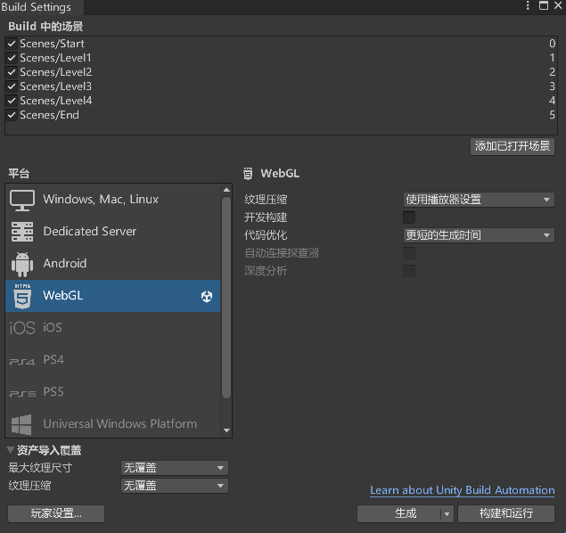
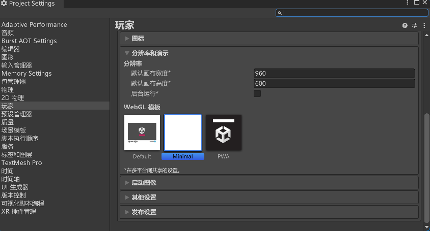
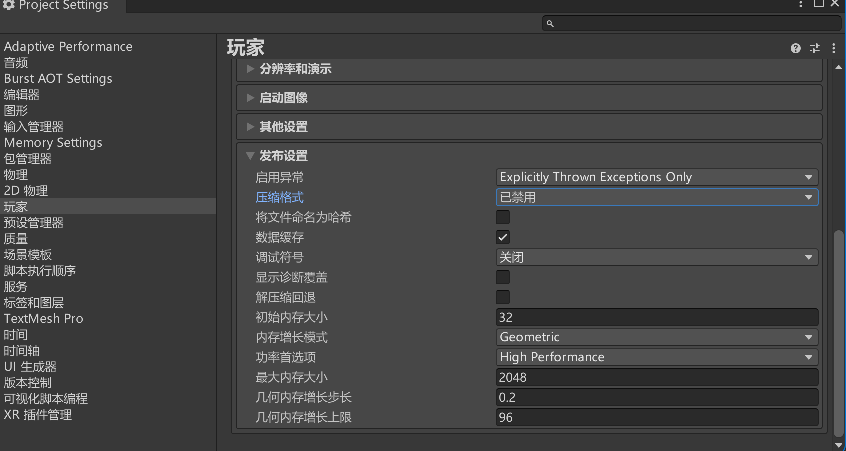

#  2024年2月16日随笔-把最近的和之前几周的一些边缘小技术和小技巧汇总一下

## 1、利用luma ai实现3d建模
* 这个实现的是十日终焉中刚出场的那个山羊头面具，技术是luma ai的text-to-3d。
https://lumalabs.ai/genie?view=one&one=35205cfc-066a-4f5d-b057-583e5a200bd6

## 2、Unity游戏的html网页化导出

* 导出完成后，将导出目录文件夹下的所有文件添加到github仓库，
* 并设置index.html的所在目录到GitHub Pages

## 3、推荐一个快捷好用的电脑内存清理工具
* 工具名称:Mem Reduct，很好用
