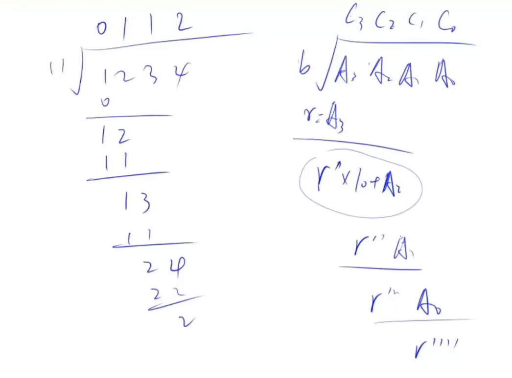

# 高精度除法

## 题目

给定两个非负整数（不含前导0）`A`和`B`，请你计算`A/B`的商和余数。

### 输入格式

共两行，第一行包含整数`A`，第二行包含整数`B`。

### 输出格式

共两行，第一行输出所求的商，第二行输出所求余数。

### 数据范围

`1≤A的长度≤100000`, `1≤B≤10000`, `B`一定不为0

### 输入样例：

```
7
2
```

### 输出样例：

```
3
1
```
## 课堂笔记

## 代码

```cpp
#include <iostream>
#include <vector>
#include <algorithm>

using namespace std;

// 定义一个函数，用于实现大数A与整数b的除法
vector<int> div(vector<int> &A, int b, int &r)
{
    vector<int> C; // 存放除法的商
    r = 0; // 用于存放余数，初始为0
    for (int i = A.size() - 1; i >= 0; i-- )
    {
        r = r * 10 + A[i]; // 将余数左移一位并加上当前位的值，准备进行除法运算
        C.push_back(r / b); // 计算当前位的商，并加入到C中
        r %= b; // 更新余数
    }
    reverse(C.begin(), C.end()); // 由于是从高位开始处理，需要反转C以恢复正常的顺序
    while (C.size() > 1 && C.back() == 0) C.pop_back(); // 去除结果前端的0
    return C; // 返回商
}

int main()
{
    string a; // 存放输入的大数A
    vector<int> A; // 用于存放大数A的每一位

    int B; // 存放输入的整数B
    cin >> a >> B; // 输入A和B
    for (int i = a.size() - 1; i >= 0; i-- ) A.push_back(a[i] - '0'); // 将大数A的每一位转化为整型并逆序存储

    int r; // 用于存放余数
    auto C = div(A, B, r); // 调用div函数计算A除以B的商和余数

    for (int i = C.size() - 1; i >= 0; i-- ) cout << C[i]; // 逆序打印商，得到正确顺序的结果

    cout << endl << r << endl; // 打印余数

    return 0; // 程序结束
}
```
